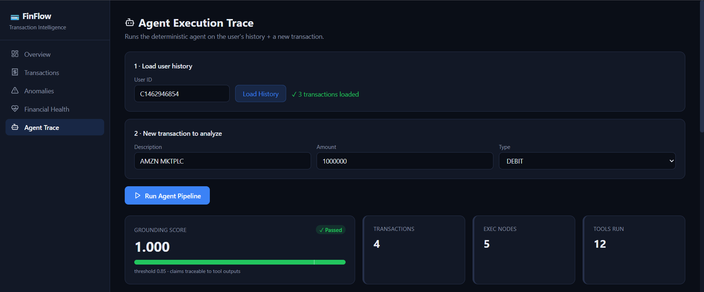
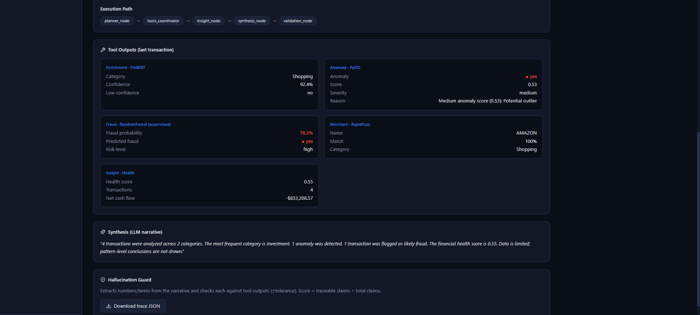
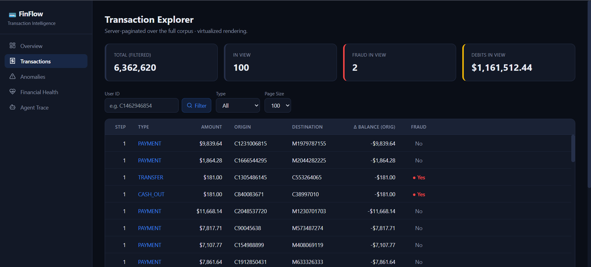
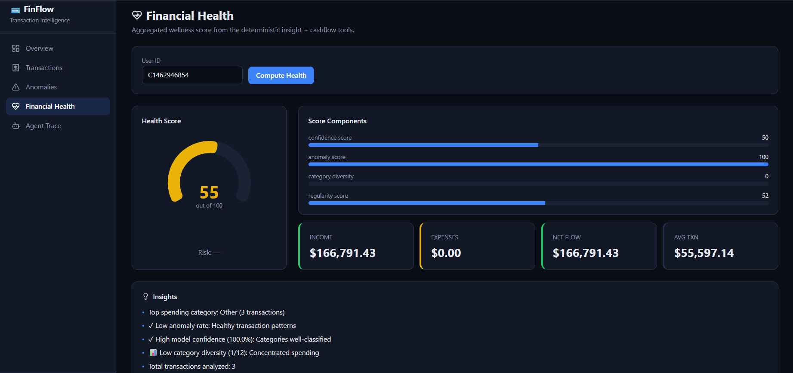

# FinFlow — Deterministic Multi-Agent Financial Transaction Intelligence

FinFlow ingests raw bank-transaction data at scale, **enriches** it (category, merchant,
cash-flow, fraud), and **explains** it through a LangGraph multi-agent workflow where the
LLM only *plans and narrates* — it never computes a number. Every financial value comes
from a deterministic Python tool, and a hallucination guard + deterministic fallback
**guarantee** that no ungrounded number is ever served. The design mirrors how regulated
fintechs (e.g. Yodlee's Transaction Data Enrichment) use LLMs without trusting them with math.

> **Why this exists:** to demonstrate end-to-end competence across **PySpark big-data
> processing**, **analytical databases**, **agentic AI with deterministic, hallucination-free
> output**, **supervised + unsupervised ML**, **fintech domain modeling**, and **system design
> for millions of daily streaming transactions**.

---

## Headline results (measured, held-out where applicable)

| Capability | Metric | Result |
|---|---|---|
| Big-data processing (PySpark) | Transactions processed (PaySim) | **6,362,620** rows, schema-enforced |
| Data quality | Failure rate | **0.0003%** |
| Transaction categorization (FinBERT, fine-tuned) | Accuracy / F1-macro | **0.9938 / 0.9938** |
| | High-confidence rate | **98.9%** |
| **Fraud detection (supervised RandomForest)** | **Recall / ROC-AUC** (held-out) | **0.988 / 0.996** |
| | False-positive rate | **0.035** |
| Novelty detection (unsupervised IsolationForest) | Controlled flag rate | ~5% (FPR ≤ 0.15) |
| Agentic workflow | Completion rate | **100%** |
| Hallucination control | Served-output grounding | **1.000** (guaranteed by fallback) |
| | Raw-LLM hallucination caught & repaired | ~12–38% → **0% served** |
| Latency | Agent single-txn p95 / cached stats p95 | **~4.6 s / 7 ms** |
| Determinism | Tool outputs identical for identical inputs | ✓ |

Full machine-readable report: `metrics/reports/final_report.json`.

---

## Screenshots






---

## Architecture

```
                         ┌────────────────────────── INGESTION (batch + stream-ready) ──────────────────────────┐
   Kafka / Kinesis  ─▶   Spark Structured Streaming (micro-batch)  ─▶  schema enforce + feature engineering
   or PaySim CSV    ─▶   Spark batch (6.3M rows)                    ─▶  Parquet feature store (partitioned)
                         └───────────────────────────────────────────────────────────────────────────────────┘
                                                          │
                                                          ▼
                         ┌──────────────────────── SERVING (stateless, N replicas) ─────────────────────────┐
                         │  FastAPI  ──  DuckDB (read-only analytics over Parquet)  ──  cached aggregates    │
                         │     │                                                                              │
                         │     ▼   POST /api/analyze                                                          │
                         │  LangGraph agent:  planner ─(routes)→ tools ─→ insight ─→ synthesis ─→ validation │
                         │                         │                                                          │
                         │   Deterministic tools (pure Python, ms-latency, no LLM):                          │
                         │     • enrichment  (FinBERT category)      • fraud      (RandomForest, supervised)  │
                         │     • merchant    (RapidFuzz resolution)  • anomaly    (IsolationForest, novelty)  │
                         │     • cashflow    (signed income/expense) • insight    (composite health score)    │
                         │                                                                                    │
                         │   LLM (Groq llama-3.1-8b): plans tool routing + narrates — never computes numbers  │
                         │   Hallucination guard: numeric grounding ≥ 0.85, else deterministic fallback       │
                         └────────────────────────────────────────────────────────────────────────────────────┘
                                                          │
                                                          ▼
                            Next.js (stateless, CDN-cacheable) — virtualized tables, agent-trace viewer
```

---

## How each target skill is demonstrated

### 1. PySpark / big-data processing
- `src/preprocessing/spark_pipeline.py`: explicit schema (never inferred), inline data-quality
  gates, windowed user-level aggregations, Parquet output partitioned by type.
- 6.36M rows processed; quality failure rate 0.0003%.

### 2. Databases
- **DuckDB** as an embedded analytical engine over columnar **Parquet** — server-side
  pagination, seeded reservoir sampling, and a `COUNT(DISTINCT)` corpus aggregate precomputed
  once at startup (2.7 s → **<5 ms** served).

### 3. Agentic AI — deterministic & hallucination-free
- **LangGraph** state machine: `planner → tools_coordinator → insight → synthesis → validation`.
- The **planner emits structured JSON** that *routes* which tools run — the LLM call has real
  agentic purpose, not decoration.
- **Deterministic tools**: all financial math is pure Python; identical input ⇒ identical output.
- **Hallucination guard** (`src/agents/hallucination_guard.py`): extracts every number the LLM
  states and verifies it traces to a tool output (numeric grounding). Below 0.85 →
  **deterministic fallback** rebuilds the narrative from tool numbers only, so the served output
  is grounded **by construction**. The API returns both `grounding_score` (served) and
  `llm_grounding_score` (raw) — honest about when the model hallucinated.

### 4. ML — the right tool for each problem
- **Supervised fraud** (`fraud_tool.py`): RandomForest on balance-error features, trained with a
  clean train/test split → **recall 0.988, AUC 0.996** on held-out fraud.
- **Unsupervised novelty** (`anomaly_tool.py`): IsolationForest for unlabeled streams. Measured
  fraud/legit score separation ≈ 0 — a **documented finding** that novelty detection ≠ supervised
  fraud classification (consistent with the PaySim literature). Both are kept and clearly scoped.
- **Fine-tuned FinBERT** for 12-class transaction categorization (accuracy 0.9938).

### 5. Fintech domain
- Transaction Data Enrichment (TDE) parallel: categorization, merchant normalization, cash-flow
  health, fraud probability, composite financial-health score — the building blocks of a real
  enrichment platform, with a full agent audit trail.

---

## System design: scaling to millions of transactions/day

**Hot path is deterministic and fast.** Enrichment, fraud, anomaly, merchant, and cashflow are
pure-Python/ML tools running in **single-digit-to-tens of milliseconds** — suitable for
per-transaction processing on a stream. The LLM narration (~2 s) is a **separate, optional,
asynchronous "explanation" layer**, not in the enrichment hot path.

| Concern | Design |
|---|---|
| **Ingestion** | Spark **Structured Streaming** micro-batches from Kafka/Kinesis; the *same* transformation code used for the 6.3M-row batch backfill (one codebase, batch + stream). |
| **Exactly-once / idempotency** | Checkpointed stream offsets; transaction-id keyed upserts to the feature store (Parquet/Delta). |
| **Feature store** | Columnar Parquet partitioned by type/date; DuckDB for low-latency reads, Spark for bulk. |
| **Serving scale** | FastAPI is **stateless** → horizontally scalable to N replicas behind a load balancer; model singletons load once per replica. |
| **Read scale** | Static corpus aggregates precomputed/cached; virtualized frontend tables render only visible rows (50 or 5,000,000 at the same DOM cost). |
| **Backpressure** | Micro-batch sizing + bounded queues; the deterministic tools degrade gracefully (heuristic fallback if a model is unavailable). |
| **Numeric hygiene** | Tools never emit `inf`/`NaN`; the guard rejects non-finite values — protecting JSON serialization and downstream math at scale. |
| **Cost control** | LLM is invoked only for the explanation path and routed by the planner to the minimal tool set; deterministic enrichment needs no LLM. |

---

## Tech stack

**Data/ML:** PySpark · pandas · DuckDB · Parquet/PyArrow · scikit-learn (RandomForest, IsolationForest) · HuggingFace Transformers (FinBERT) · RapidFuzz · statsmodels
**Agent/API:** LangGraph · LangChain · Groq (llama-3.1-8b) · FastAPI · Pydantic
**Frontend:** Next.js 14 (App Router) · React · TanStack Query/Table/Virtual · Recharts · Tailwind
**Eval/quality:** pytest · custom integration harness · loguru

---

## Quick start

```bash
# 1. Backend (loads models, trains/loads anomaly + fraud, precomputes stats)
python -m uvicorn src.api.main:app --reload          # http://localhost:8000

# 2. Frontend
cd frontend && npm install && npm run dev             # http://localhost:3000

# 3. Reproduce the metrics
python scripts/run_evaluation.py --agent-samples 8 --anomaly-samples 1500
```

**Dashboard tour:** `/agent-trace` is the showpiece — enter a user, load their history, run the
pipeline, and watch the planner route tools, the deterministic tools execute, and the grounding
guard validate (or replace) the narrative.

---

## Deployment (Docker · GitHub Actions · Google Cloud Run)

The serving layer is **stateless**, so it containerizes cleanly and scales
horizontally with zero code changes.

- **Docker** — multi-stage `Dockerfile` builds a lean, non-root serving image
  with **CPU-only torch** (skips ~2 GB of unused CUDA) and no build toolchain in
  the final layer. `docker compose up` runs the API + Next.js frontend locally.
- **CI** (`.github/workflows/ci.yml`) — on every push/PR: ruff lint → byte-compile
  + import smoke (boots without the dataset) → **`docker build` + `/health`
  container smoke test** (with GitHub-Actions layer caching).
- **Cloud Run** (`.github/workflows/deploy-cloudrun.yml`) — one-command,
  on-demand deploy: `gcloud run deploy finflow-api --source .` builds the
  Dockerfile via Cloud Build and rolls out a scale-to-zero revision behind HTTPS.

State is **externalized** (Parquet/DuckDB, model artifacts) rather than baked
into the image — the property that lets the service scale to N replicas. Full
setup + deploy guide: **[`deploy/README.md`](deploy/README.md)**.

**Live status:** deployed to Cloud Run through the GitHub Actions pipeline and
running as an **IAM-protected** service (unauthenticated `allUsers` access is
intentionally disabled by organization policy — as it should be for a financial
service). Reach it with an identity token:

```bash
curl -H "Authorization: Bearer $(gcloud auth print-identity-token)" <service-url>/health
# {"status":"healthy","version":"1.0.0"}
```

---

## Repository layout

```
src/
├── preprocessing/   # PySpark pipeline (schema, features, quality gates)
├── models/          # FinBERT classifier + evaluation
├── tools/           # deterministic tools: enrichment, fraud, anomaly, merchant, cashflow, insight
├── agents/          # LangGraph state, nodes, graph, hallucination guard
├── data/            # DuckDB client over Parquet
└── api/             # FastAPI (CORS, analyze, transactions, statistics, fraud)
frontend/            # Next.js dashboard
scripts/             # run_evaluation.py, find_users.py, generate_sample_data.py
metrics/reports/     # finbert_evaluation.json, fraud_evaluation.json, final_report.json
.github/workflows/   # ci.yml (lint+smoke+docker), deploy-cloudrun.yml
deploy/              # Cloud Run deploy + gcloud setup guide
Dockerfile           # multi-stage, CPU-torch, non-root serving image
docker-compose.yml   # local API + frontend stack
requirements-api.txt # runtime-only deps (lean serving image)
PLAN.md              # full phase-by-phase design + status
```

---

## Design decisions worth calling out

1. **LLM plans and narrates; tools compute.** The only defensible way to use an LLM on money.
2. **Grounding guard + deterministic fallback** make hallucination a *handled* failure mode, not a
   risk — the system never serves an ungrounded number.
3. **Supervised fraud where labels exist, unsupervised novelty where they don't** — and the eval
   grades each on the *right* metric.
4. **One transformation codebase for batch and stream**, so the 6.3M-row backfill and the live
   micro-batch share logic.
5. **Stateless serving + virtualized UI** so scale lives in the data/serving layers, not the
   framework.
